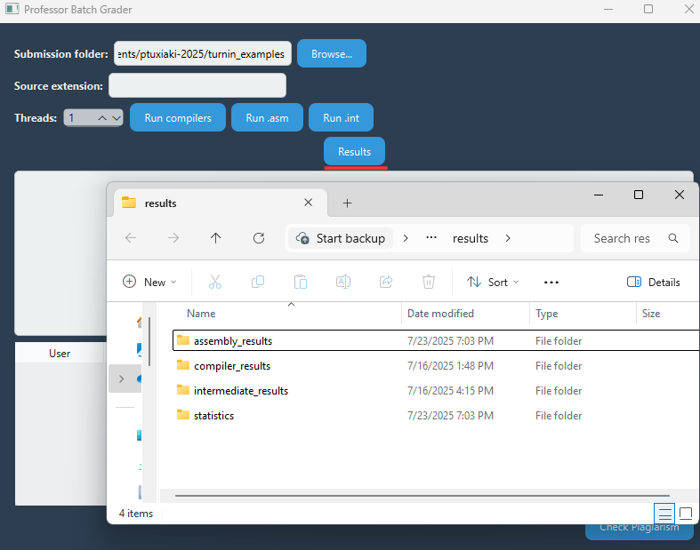
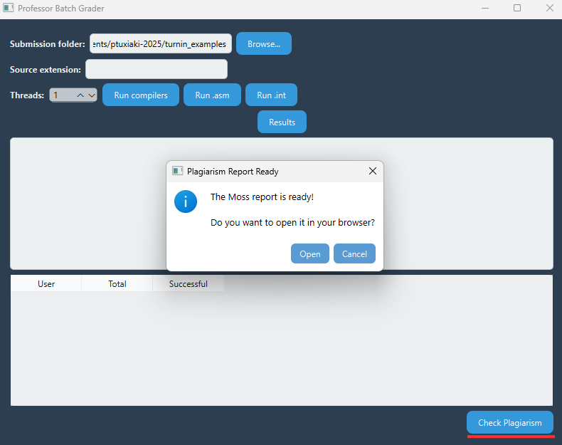

# Educator Batch Compilation and Feedback Platform

This is a desktop app made to help teachers check student programming assignments more easily. It runs each student’s compiler, processes the generated intermediate and assembly files, collects the results, and displays a summary of what worked and what didn’t. It can also check for plagiarism by comparing code between students.


---

## 🧩 Features

- 🔍 Finds each student's compiler and matching source files
- 🧪 Runs the compiler on each source file one by one
- 🖥️ Lets you run all `.int` and `.asm` files in one
- 📊 Shows statistics for each student with success/failure info
- 🕵️‍♂️ Compares student submissions to detect possible plagiarism
- 🧵 Uses multithreading to handle many students at once
- 🧪 Can be tested with `pytest`

---

## 🚀 Quick Start

### 1. Install Required Software

- ✅ [Cygwin](https://www.cygwin.com/)
- ✅ GCC compiler
- ✅ Python 3.10 or later
- ✅ Java 

Make sure Cygwin’s `bin` folder (e.g., `C:\cygwin64\bin`) is in your system PATH. If not, you can set the Cygwin path manually in the `config.json` file.

### 2. Clone the Repository

```bash
git clone https://github.com/your_username/batch-compilation-feedback.git
cd batch-compilation-feedback
```

### 3. Run the App

```bash
python3 main.py
```


### 🏠 Main Window

This is the main interface of the application, where the instructor selects the folder containing student submissions, chooses the source file extension (e.g., .ci, .cpy), and runs the batch process. :exclamation: TODO: support .gr source files :exclamation:

 docs/base.png

---

### ▶️ Running All Compilers

Clicking "Run" processes all student compilers and source files in batch mode.

 docs/run_compilers.png

---

### 🧪 Running Intermediate Code (.int)

After compilation, you can run each student’s intermediate files and view the output.

 docs/run_int.png

---

### ⚙️ Running Assembly Code (.asm)

Assembly files can also be executed, with support for interactive inputs where needed.

 docs/run_asm.png

---

### 📊 View Results

After any compilation or execution, you can click **Results** to open a folder with each student's output files and summaries.



---

### 🕵️‍♀️ Check for Plagiarism

The app also supports code similarity detection. You can run plagiarism checks and view a report comparing student files.



## 🗂️ Project Structure

```
TODO
```

---

## 📁 Input Format

Each student folder must include:
- A Python file (e.g., `compiler.py`) that acts as a compiler
- One or more source files (e.g., `.ci`, `.cpy`) 

The app runs:

```bash
python3 <compiler>.py <source_file>
```

And stores the output in:

```
<student_folder>/results/compiler_output_<student>.txt
```

---

## 🧠 Execution Flow

- `.int` files are translated into C and compiled using GCC through Cygwin
- `.asm` files are run using `rars_46ab74d.jar`
- You can run each step from the GUI and see the output

---

## 📈 Statistics Table

After processing, a table shows up in the app with each student’s results.

### 🛠️ Compiler Results

| User       | Total source files | Successful |
|------------|--------------------|------------|
| cs2023001  | 2                  | 2          |
| cs2023002  | 1                  | 0          |
| ...        | ...                | ...        |

### ⚙️ Assembly Results

| User       | Total asm files | Successful | Simulation Error | Timeout |
|------------|-----------------|------------|------------------|---------|
| cs2023001  | 2               | 2          | 0                | 0       |
| cs2023002  | 2               | 1          | 1                | 0       |
| ...        | ...             | ...        | ...              | ...     |

### 🧪 Intermediate Results

| User       | Total .int files | Successful |
|------------|------------------|------------|
| cs2023001  | 3                | 3          |
| cs2023002  | 2                | 1          |
| ...        | ...              | ...        |

These tables help the teacher easily spot which submissions failed and how many passed.

---

## 🧪 Testing

To run tests:

```bash
pytest -vv tests/
```

Expected results should be placed in:

```
tests/expected_results/
```

---

## 🖼️ Screenshots

TODO
