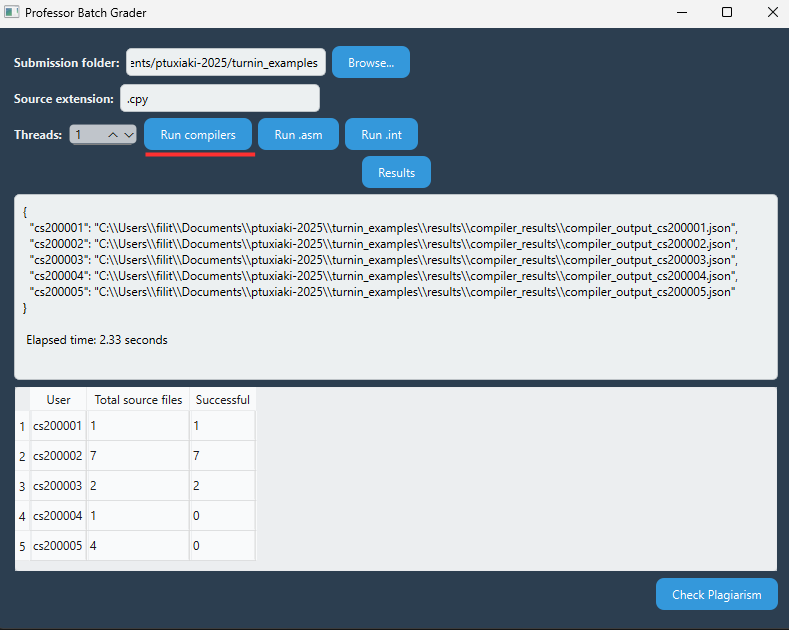

# Educator Batch Compilation and Feedback Platform

This is a desktop app made to help teachers check student programming assignments more easily. It runs each student’s compiler, processes the generated intermediate and assembly files, collects the results, and displays a summary of what worked and what didn’t. It can also check for plagiarism by comparing code between students.


---

## 🧩 Features

🔍 Detects each student’s compiler and matching source files  
🧪 Runs the compiler on all relevant source files per student  
🖥️ Runs all `.int` and `.asm` files in one step  
📊 Shows per-student statistics (successes, errors, timeouts)  
🕵️‍♂️ Detects possible plagiarism using Moss  
🧵 Uses multithreading for faster processing  
🧪 Supports testing with `pytest`


---

## 🚀 Installation and set up

### 1. Install Required Software

Make sure you have the following installed:

- ✅ Python 3.10 or later  
- ✅ GCC compiler  
- ✅ Java (for running `.asm` files)

> 🪟 **On Windows**: You also need [Cygwin](https://www.cygwin.com/) to use GCC.  

---


### 2. Clone the Repository

```bash
git clone https://github.com/your_username/batch-compilation-feedback.git
cd batch-compilation-feedback
```

### 3. Configure Cygwin Path (Windows only)

If you're using Windows:

- Add the Cygwin `bin` folder (e.g., `C:\cygwin64\bin`) to your system `PATH`, **or**
- Open the `config.json` file in the project and set the full path to the Cygwin `bin` directory there


### 4.  Set Up Plagiarism Detection (MOSS)

To enable Moss-based plagiarism checking:

- Create a folder named `/scripts` at the root of the project  
- Place the Moss script inside that folder 
- Make sure the script includes your **Moss user ID**

💡 Don’t have a Moss ID? Request one by emailing: [`moss@moss.stanford.edu`](mailto:moss@moss.stanford.edu)


### 5. Run the App

```bash
python3 main.py
```

---

## 🔧 How to use


---

### 🏠 Main Window

This is the main interface of the application:


---

#### 1️⃣ Choose **Submission Folder**

Select the folder that contains all student submissions.  
Each subfolder should represent one student and must include:

- A Python file (e.g., `compiler.py`) — the student’s custom compiler  
- One or more source files (e.g., `.ci`, `.cpy`, or any supported extension)

##### 📂 Example Folder Structure


submissions/

▶ submissions/

├─▶ cs2023001/

│  ├── compiler.py

│  ├── program.ci

│  └── extra.ci

├─▶ cs2023002/

│  ├── compiler.py

│  └── solution.ci

├─▶ cs2023003/

│  ├── compiler.py

│  └── fibonacci.ci


---

#### 2️⃣ Choose **Source Extension**  ❗ `.gr` is NOT supported yet ❗

Enter the extension of the source files you want to compile (e.g., `.ci`, `.cpy`).  
Only files with this extension will be passed to the student’s compiler.

---

#### 3️⃣ Choose **Threads**

Select how many worker threads to use for parallel processing. (Default = 1)


---
### ⚙️ Running All Compilers

Clicking **"Run Compilers"** starts processing all student submissions together.  
For each student, the app runs their own compiler script on the source files found in their folder.  
The results are saved in JSON format inside the `results/` folder.  
Only summary statistics are shown in the GUI.



Each row shows:

- **user**: The student’s ID (e.g. their folder name)
- **total**: The number of source files in their folder
- **successful**: How many of those compiled successfully


 
---

### ⚙️ Running Intermediate Code (.int)

Clicking **"Run .int"** executes all `.int` files from all students in one go.  
Each file is translated to C and compiled using GCC.  
Execution results are saved in JSON files, and a summary of success/failure is shown in the GUI.


 

Each row shows:

- **user**: The student’s ID  
- **total**: The number of `.int` files in their folder  
- **successful**: How many were successfully translated to C and executed  

---

### ⚙️ Running Assembly Code (.asm)

Clicking **"Run .asm"** runs all `.asm` files from all students together using RARS - RISC-V.  
The simulation results are stored as JSON files, with a summary shown in the GUI.


 

Each row shows:

- **user**: The student’s ID  
- **total .asm files**: The number of `.asm` files in their folder  
- **successful**: How many were executed correctly  
- **simulation error**: How many crashed or produced errors during execution  
- **timeout**: How many were force-stopped due to taking too long  


---

### 📊 View Results

After any compilation or execution, click **Results** to open the folder containing all result files.  
Each student has a dedicated folder with JSON outputs and logs, which you can inspect manually.


---

### 🕵️‍♀️ Check for Plagiarism

The app supports plagiarism detection by comparing student submissions.  
Clicking the plagiarism button runs a similarity check and shows a report of any suspicious matches by using [MOSS](https://theory.stanford.edu/~aiken/moss/)
.


## 🧪 Testing

To run tests:

```bash
pytest -vv tests/
```

Expected results should be placed in:

```
tests/expected_results/
```

---

